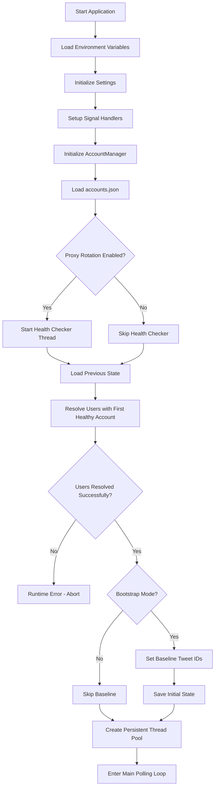
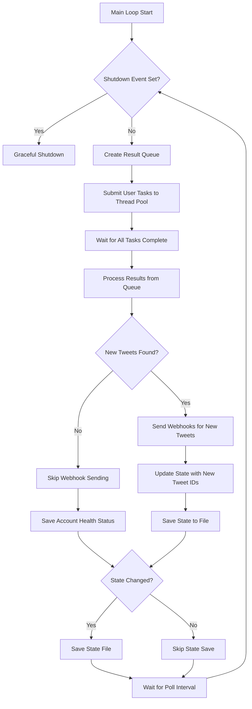
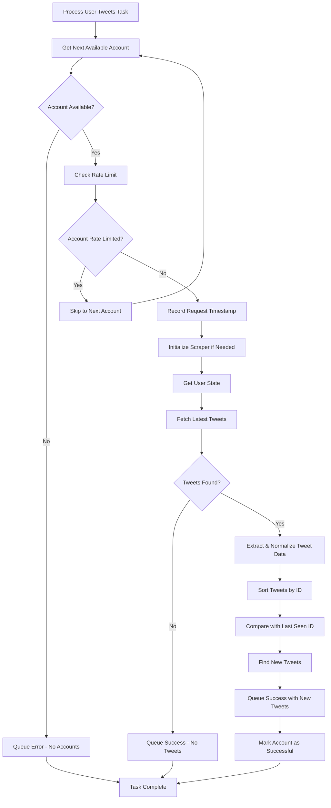
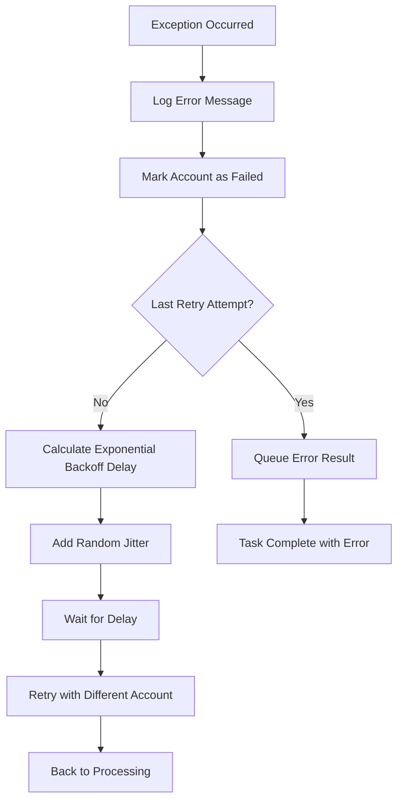
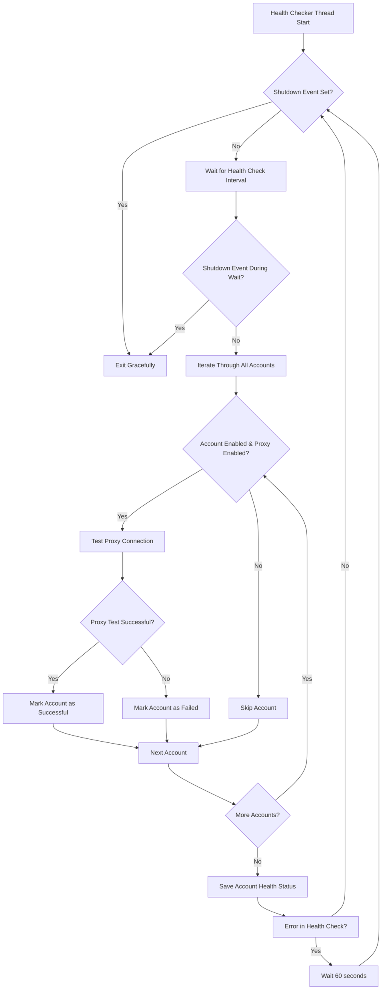
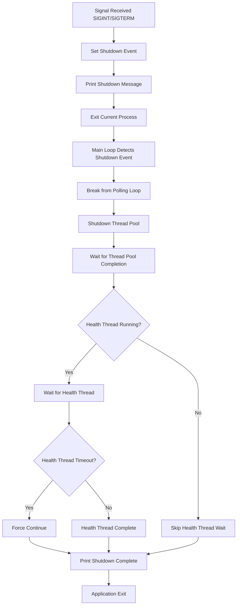
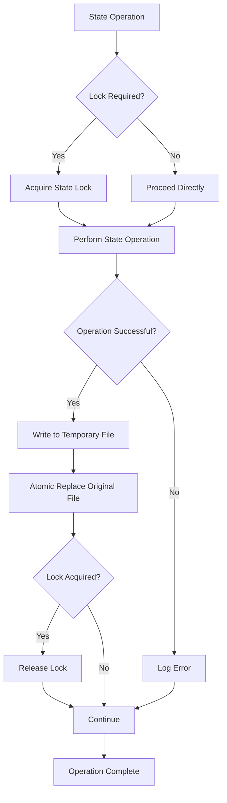
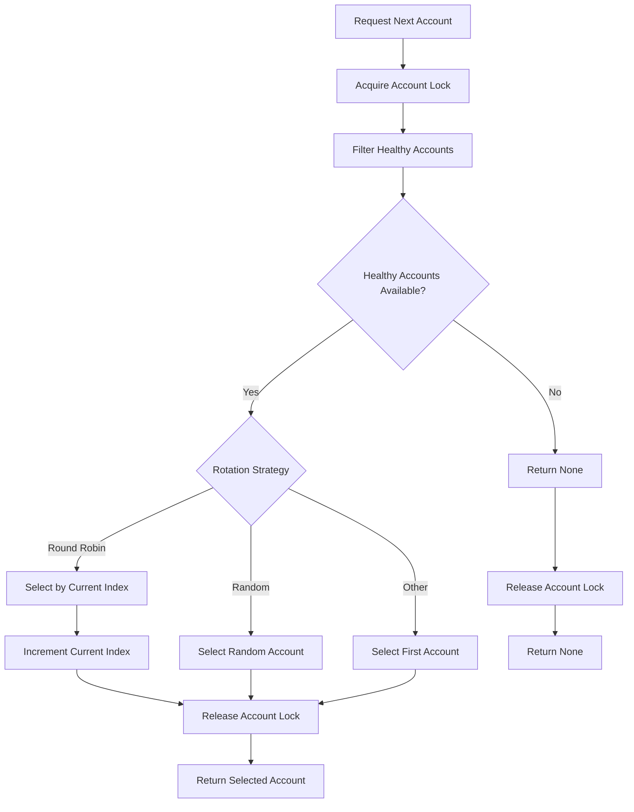
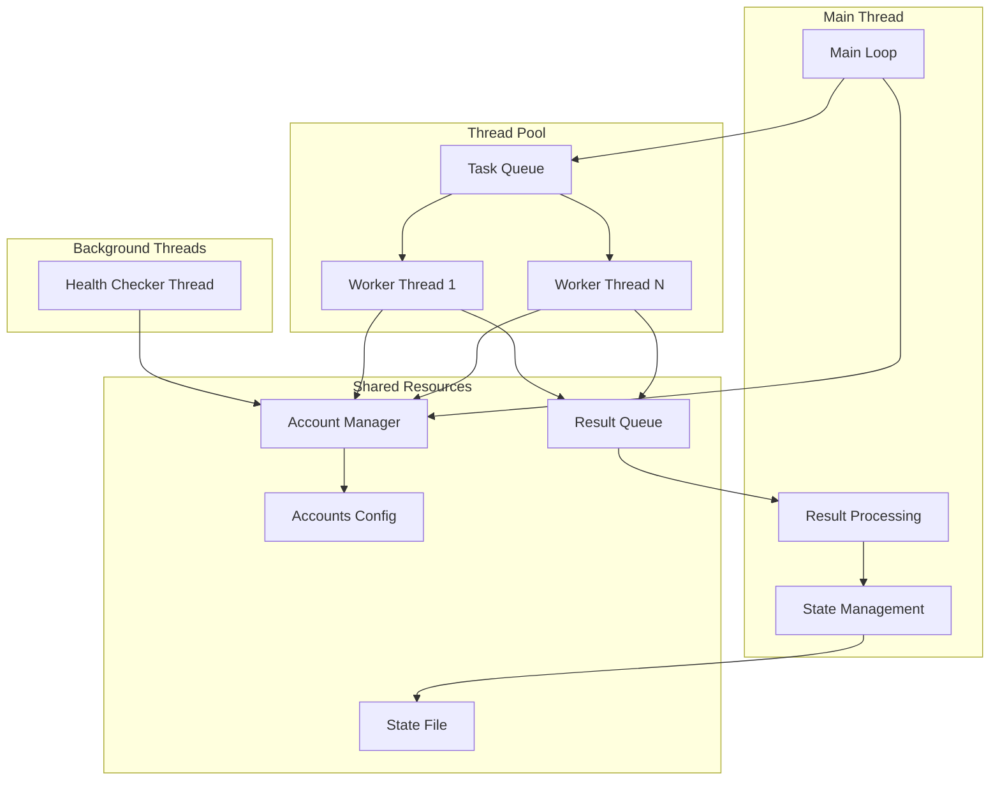
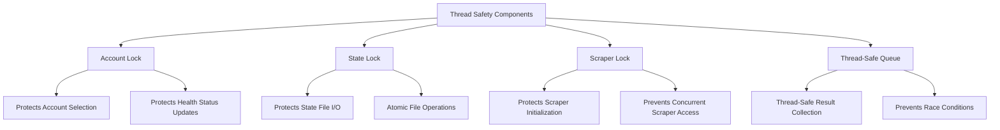

# X-Interact Tracker - Flow Diagram

## 1. Application Startup Flow



## 2. Main Polling Loop Flow



## 3. User Tweet Processing Flow



## 4. Error Handling & Retry Flow



## 5. Proxy Health Checker Flow



## 6. Graceful Shutdown Flow



## 7. State Management Flow



## 8. Account Rotation Flow



## Key Components Interaction



## Thread Safety Mechanisms



## Performance Optimizations

```mermaid
graph TD
    A[Performance Features] --> B[Deque for Rate Limiting]
    A --> C[Connection Pooling]
    A --> D[Persistent Thread Pool]
    A --> E[Smart State Saving]
    
    B --> F[O(1) Rate Limit Checks]
    B --> G[Automatic Memory Cleanup]
    
    C --> H[Reduced TCP Overhead]
    C --> I[Connection Reuse]
    
    D --> J[No Thread Creation Overhead]
    D --> K[Resource Reuse]
    
    E --> L[Save Only When Changed]
    E --> M[Reduced Disk I/O]